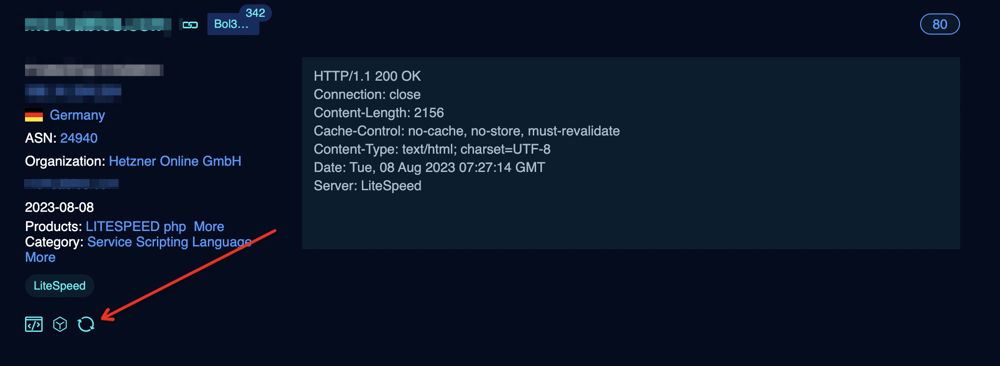

# 如何自主刷新自己在FOFA的资产？

## 写在前面
在我们的日常工作中，会有一种情况。那就是可爱的FOFA工程师联系我们：“Hello，我们用来测试的资产被FOFA收录了，请问有什么办法隐藏掉吗？”

 

出现这种情况的原因多种多样，可能是因为运维操作不当，研发随意上线甚至是自家的供应链自己测试所用，导致一不小心把不应该暴露在公网上的网站暴露在了公网上，并被网络空间测绘扫到。

 

然后：被通报、一级一级下来，我们可怜的工程师就联系到我们。那今天就单单从FOFA的角度来说，当出现这种情况的话，该如何处置？

 

其实FOFA是覆盖式扫描，当你这个资产进行更新了之后，当前的资产信息就会被覆盖掉，但是被通报开发一着急就把资产删了，那FOFA就会把这条数据当作一条历史数据进行了存留不再更新，并一直留在了那里。

 

正常的方式是，将暴露的资产信息进行替换，然后等待网络空间测绘进行扫描进行覆盖，Done！

 

但是，大家都是吉吉国王，想马上处理，这种心情非常的可以理解。

 

"强制刷新"功能应运而生，相信大家有时候在Bot的FOFA截图中有看到，我比你们多一些按钮，"强制刷新" 就是其一。它长这样。

有一次跟老板开会说到，网络安全任重而道远啊！信息泄露的事情还是时有发生，FOFA工程师联系到我们，处理起来还需要验证身份等等流程，再进行扫描插队。

 

老板说，既然这样你就把他直接开放给大家，自动化的流程解决这个问题就行了呀！我顿时茅塞顿开，那就直接开放该功能！

 

## 如何使用该功能？
当然开也不能盲目的开，要不然甚至可能会成为DDos。我们做了一点小小的限制，首先你得证明这条网络资产是你的～

所以在点击强制刷新的时候，会有一个文件提供给你，需要大家把文件放进自己同样IP端口和域名的根目录中，完成后再次在FOFA中点击强制刷新，这样就可以啦！如果你的操作无误，最长48小时该资产就会进行强制更新。

所以，整个处理流程非常的简单。

第一步：将泄露信息的页面替换成新页面；

第二步：在FOFA中点击强制刷新，获取TXT并放入资产根目录中；

第三步：回到FOFA再次点击强制刷新。

 

完成！

 

这个功能已经开放给所有用户可用，只要是注册了FOFA账号的用户都可以进行使用，当然如果你不是吉吉国王，替换掉等待FOFA自动扫描刷新也是可以的。这个就是信息泄露暴露在FOFA该怎么办的全部流程和方法啦。不过Bot还是想说，网络安全就是国家安全，大家一定要规范操作，避免因为人为操作导致的信息泄露所造成的损失啊！
