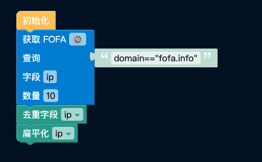
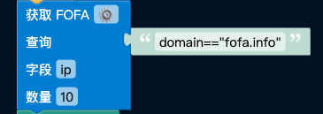

# 资产聚合

- 根据输入的查询语句进行资产聚合

[](https://store.fofa.info/fofahub/doc/video/%E8%B5%84%E4%BA%A7%E8%81%9A%E5%90%88_20231219.mp4)

- 通过将查询资产上传至最上面的积木块中，即可查询资产对应的产品和产品分类。再将当前所获取的产品和分类进行聚合，最终以csv格式进行输出

## 适用场景

- 需要批量统计资产的产品和产品分类的人员

## 使用方法
- 将待查询的资产设置为一行一个的文本，上传至对应积木块，然后执行。

## 执行结果
- 以 60.28.163.107 为例，对应查询结果为

|ip|products|categories|
|:--:|:--:|:--:|
|60.28.163.107	|Bootstrap,Log4j2,NGINX,Oracle-JAVA,Oracle-JSP,html5.js,jQuery,协同办公系统,统一身份认证平台,致远互联-OA	|中间件,其他企业应用,办公自动化系统（OA）,开发框架,服务,组件,脚本语言


## 步骤分解
- 本次的流程中共计 3 个积木块，与最开始的初始化模块，下面我们将挨个讲解每个块的用途。



### 获取 FOFA
- 顾名思义，获取 FOFA 块通过 FOFA API 对右边的输入内容进行查询

- 字段为 API 接口返回的字段，在这里我们只需要它的 ip，所以只返回 ip 字段

- 数量默认设置为10，方便大家测试 demo 使用，数量设置在 100 条以上后会调用自身的 API



### 去重字段 ip
- 这里可以指定根据哪个字段进行去重，去重后仅保留当前字段，以当前案例为例，去重后仅剩已去重的 ip 字段


- 如果需要保留其余字段，我们可以在下个文章中展开讲解
### 扁平化 ip
- 扁平化针对于列表、多行json设置，将指定的字段进行扁平化处理。


- 以当前数据为例，去重 ip 后的数据如下：
```json
{"ip":"106.xx.xx.17"}
{"ip":"118.xx.xx.182"}
{"ip":"161.xx.xx.172"}
{"ip":"172.xx.xx.15"}
{"ip":"222.xx.xx.181"}
```
- 那么在扁平化之后，当前数据被改为：
```
106.xx.xx.17
118.xx.xx.182
161.xx.xx.172
172.xx.xx.15
222.xx.xx.181
```